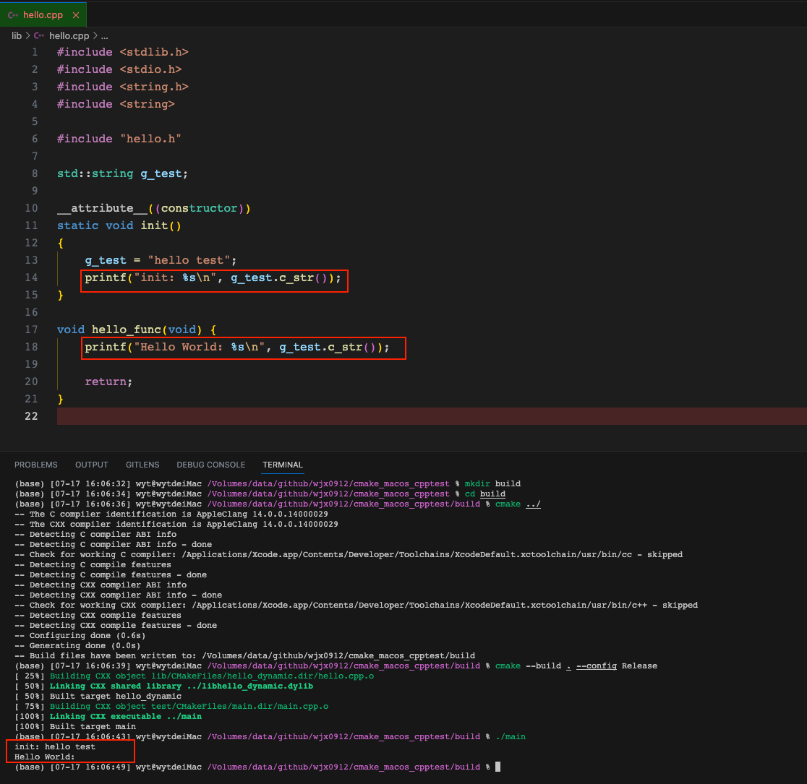

问题：

期待的打印是：Hello world: hello test，但是实际g_test没有打印出来，为啥呢？

测试环境：mac-12.6

答案：https://stackoverflow.com/questions/43941159/global-static-variables-initialization-issue-with-attribute-constructor-i

讨论过程：https://www.v2ex.com/t/957438
